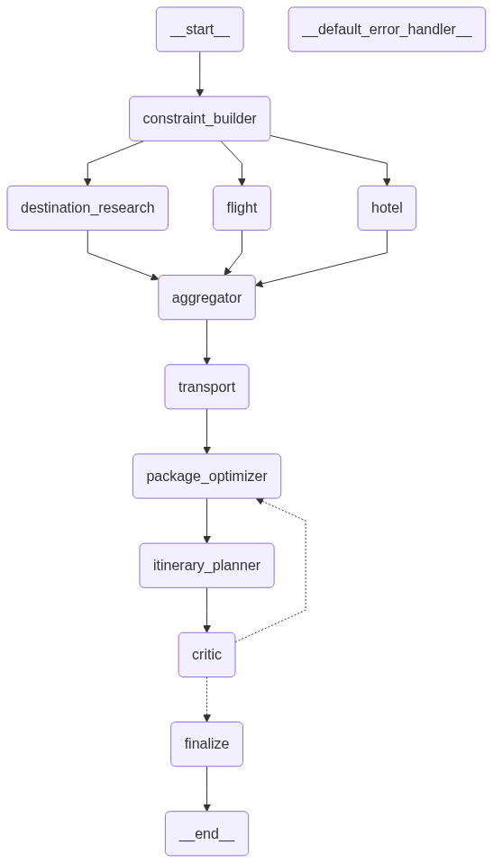

# ✈️ Travido

**Travido is a multi-agent AI travel planner that turns a simple request into a complete, personalized trip plan.**

Describe where you want to go, your budget, dates and interests. Travido's specialized agents research destinations, build an itinerary, and refine it into a plan you can actually follow, all orchestrated through a graph-based workflow.

[](LICENSE)


---

## 📖 Description

Planning a trip means juggling destinations, budgets, weather, activities and logistics across many tabs. Travido automates that process with a team of cooperating AI agents. Each agent has one job (understanding the request, gathering information, planning, reviewing), and a workflow graph controls how they hand work to each other and share state.

**Short repo description (for the GitHub "About" box):**

> Multi-agent AI travel planner built with a graph-based workflow: specialized agents, tools and chains that turn a travel request into a personalized itinerary.

**Suggested topics:** `ai-agents` `multi-agent` `travel-planner` `langchain` `langgraph` `llm` `python` `itinerary`

---

## ✨ Features

- 🤖 **Multi-agent architecture**: specialized agents collaborate instead of one monolithic prompt
- 🔗 **Composable chains**: reusable LLM chains for each planning step
- 🛠️ **Tool integration**: agents call external tools (search, weather, places, etc.) for real-world data
- 🧠 **Shared state management**: a typed state object flows through the whole workflow
- 🗺️ **Workflow graph**: visualized in `workflow_graph.png` / `workflow_graph.mmd`
- 🖥️ **User interface**: a front end in `ui/` to interact with the planner
- ⚙️ **Centralized configuration** via `config.py`

---

## 🏗️ Architecture

The workflow graph is stored as a Mermaid file (`workflow_graph.mmd`) and an image (`workflow_graph.png`).



High-level flow:

1. **Input**: the user submits a travel request (destination, dates, budget, preferences).
2. **Understanding**: the request is parsed into structured state.
3. **Research**: agents use tools to gather destination and logistics data.
4. **Planning**: an itinerary is generated using chains and the shared state.
5. **Review / refinement**: the plan is checked and improved where needed.
6. **Output**: the final itinerary is returned to the UI.

---

## 📁 Project Structure

```
Travido/
├── Agents/          # Agent definitions (each agent's role and behavior)
├── Architecture/    # Design notes and architecture documentation
├── Chains/          # Reusable LLM chains used by the agents
├── Instructions/    # Prompts and system instructions
├── States/          # State schemas shared across the workflow
├── Tools/           # Tools the agents can call (search, APIs, etc.)
├── Workflow/        # Graph construction and orchestration logic
├── ui/              # User interface
├── config.py        # Configuration (models, API keys, settings)
├── workflow_graph.mmd   # Workflow diagram (Mermaid source)
├── workflow_graph.png   # Workflow diagram (image)
└── LICENSE          # MIT License
```

---

## 🚀 Getting Started

### Prerequisites

- Python 3.10+
- An API key for your LLM provider
- API keys for any external tools you enable

### Installation

```bash
# 1. Clone the repository
git clone https://github.com/moonmido/Travido.git
cd Travido

# 2. Create and activate a virtual environment
python -m venv venv
source venv/bin/activate        # On Windows: venv\Scripts\activate

# 3. Install dependencies
pip install -r requirements.txt
```

### Configuration

Create a `.env` file in the project root and add your keys:

Adjust models and settings in `config.py`.

### Run

```bash
# Launch the UI (adjust the entry point to match your project)
python ui/app.py
```

---

## 💡 Example

**Input**

> "Plan a 5-day trip to Istanbul in November for two people, mid-range budget, interested in food and history."

**Output**

A day-by-day itinerary with suggested sights, meals, transport tips, and an estimated budget.

---

## 🗺️ Roadmap

- [ ] Add real-time flight and hotel search tools
- [ ] Budget optimization agent
- [ ] Export itineraries to PDF / calendar
- [ ] Multi-language support
- [ ] Saved trips and user profiles

---

## 🤝 Contributing

Contributions are welcome!

1. Fork the repository
2. Create a feature branch (`git checkout -b feature/amazing-feature`)
3. Commit your changes (`git commit -m "Add amazing feature"`)
4. Push the branch (`git push origin feature/amazing-feature`)
5. Open a Pull Request

---

## 📄 License

Distributed under the MIT License. See [`LICENSE`](LICENSE) for details.

---

## 👤 Author

**Boutmedjet Abd elmoudjib** ([@moonmido](https://github.com/moonmido))
